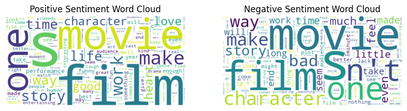

# Sentiment_Classification

## Overview
In this script, I demonstrate sentiment classification using BERT (Bidirectional Encoder Representations from Transformers), a cutting-edge natural language processing (NLP) model. The goal is to classify the sentiment of sentences as either positive or negative.

## Data Analysis
To start off, I load the dataset using the datasets library. The dataset is already divided into train, validation, and test sets, with each containing sentences labeled with either 0 (indicating negative sentiment) or 1 (for positive sentiment). I perform initial exploration by examining the distribution of labels and the length of sentences.

### Sentiment Labeling
The dataset consists of two labels: 0 for negative sentiment and 1 for positive sentiment. Upon analysis, I notice a slight imbalance in the dataset, with more positive samples than negative ones.

### Word Cloud Visualization
To gain insights into the most frequent words associated with each sentiment, I generate word clouds for both positive and negative sentiments. These visualizations help in understanding the prominent words in each category.

### N-gram Analysis
Next, I extract N-grams (bi-grams and tri-grams) from the sentences to analyze the most common sequences of words. This provides valuable insights into the language patterns associated with different sentiments.

## Model Construction
Using the transformers library, I construct a BERT model for sequence classification. I fine-tune the model on the training dataset and evaluate its performance on the validation set.

## Model Evaluation
I then evaluate the trained model on the test set to measure its accuracy and loss. By computing the average test accuracy, I determine the effectiveness of the model in classifying sentiment.

## Sentiment Prediction
Finally, I apply the trained model to predict the sentiment of a real review obtained from a fast food chain. After passing the review through the model, I display the predicted sentiment (positive or negative), shwowing that it can a appropriately generalize real world applciations. 

### Dependencies
To run this script, you'll need the following dependencies:

datasets
torch
numpy
pandas
seaborn
matplotlib
wordcloud
nltk
transformers
tqdm
Usage

## Real World Application

Sentence: "Guess what ordinary big mac instead was in the order its been binned. Reason whoever did the order, should be ashamed if themselves. You must remember allergies , as a example. I'm not given the medical info of what but one person is responsible at all times to make sure this type of issues never or should not happen. That's the CEO."
Predicted Sentiment: Negative
